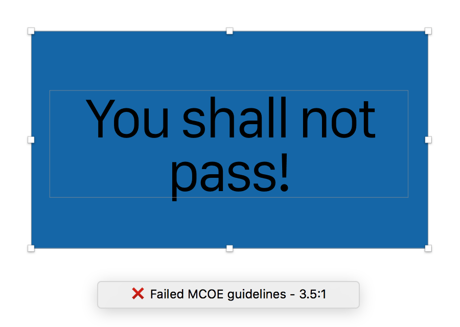

# Color Contrast Analyzer for Sketch

This Sketch plugin is based on Florian Schulz's [Color Contrast Analyser] (https://github.com/getflourish/Sketch-Color-Contrast-Analyser). It calculates the color contrast of two layers and evaluates them against MCOE's guidelines. If only a single layer is selected, than it will calculate with its artboard background color. The test may pass or fail because of a lack of contrast. When you do not need to meet the requirements, you see the actual ratio so you know how far off you are. This might help you design accessible content.

### MCOE requirements
Color contrast of **6:1** or **4:1 for large text**

### AA requirements
Color contrast of **4.5:1** or **3.0:1 for large text**

### AAA requirements
Color contrast of **7.0:1** or **4.5:1 for large text**.

##Notes
- **Large text** means a font size of at least 18pt regular or 14pt bold. [Further details can be found in the Web Content Accessibility Guidelines 2.0.](http://www.w3.org/WAI/WCAG20/quickref/#qr-visual-audio-contrast-contrast)
- This plugin works with solid text and fill colors. Transparency is not supported yet. 
- Calculations are based on [these color contrast algorithms.](http://gmazzocato.altervista.org/colorwheel/algo.php)
- Read the [MCOE Accessibility Guidelines] (https://confluence.davita.com/display/MCoE/Accessibility)
